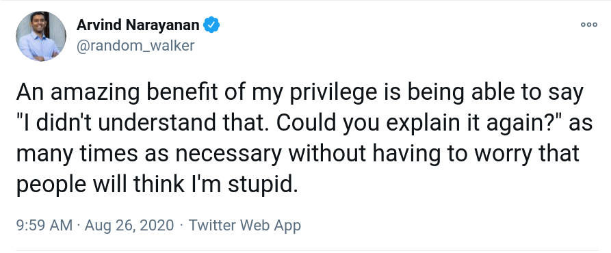

# Overview

This course will help social science graduate students to think computationally and develop proficiency with computational tools and techniques, necessary to conduct research in computational social science. Mastering these tools and techniques not only enables students to collect, wrangle, analyze, and interpret data with less pain and more fun, but it also let students to work on research projects that would previously seem impossible.

## Textbook 

[The online book version](https://jaeyk.github.io/PS239T/) of the course materials by Jae Yeon Kim is currently work in progress. 

## Learning Objectives

- The goal of this course is to help students become a more efficient and innovative researcher by leveraging the power of automation.

- The course is currently divided into two main subjects (fundamentals and applications) and six main sessions. 

### Part I Fundamentals

- In the first section, students learn best practices in data and code management using Git and Bash. 

- In the second, students learn how to wrangle, model, and visualize data easier and faster. 

- In the third, students learn how to use functions to automate repeated things and develop their own data tools (e.g., R packages, Shiny apps). 

### Part II Applications

- In the fourth, students learn how to collect and parse semi-structured data at scale (e.g., scraping websites, PDF files, and social media posts). 

- In the fifth, students learn how to analyze high-dimensional data (e.g., text) using machine learning. 

- In the final, students learn how to access, query, and manage big data using SQL. 

We will learn how to do all of the above mostly in [**R**](https://www.r-project.org/about.html), and sometimes in [**bash**](https://www.gnu.org/software/bash/) and [**Python**](https://www.python.org/about/).

  - Why R? R is free, easy to learn (thanks to [`tidyverse`](https://www.tidyverse.org/) and [RStudio](https://rstudio.com/)), fast (thanks to [`rcpp`](https://cran.r-project.org/web/packages/Rcpp/index.html)), runs everywhere, **open** (16,000+ packages; counting only ones [available at CRAN](https://cran.r-project.org/web/packages/)), and has a growing massive and inclusive community ([`#rstats`](https://twitter.com/search?q=%23rstats&src=typed_query)).
  
  - Why R + Python + bash?

       >> "For R and Python, Python is first and foremost a programming language. And that has a lot of good features, but it tends to mean, that if you are going to do data science in Python, you have to first learn how to program in Python. Whereas I think you are going to get up and running faster with R, than with Python because there’s just a bunch more stuff built in and you don’t have to learn as many programming concepts. You can focus on being a great political scientist or whatever you do and learning enough R that you don’t have to become an expert programmer as well to get stuff done." - Hadley Wickham
  
      - However, this feature of the R community also raises a challenge. 
      
      >> Compared to other programming languages, the R community tends to be more focused on results instead of processes. Knowledge of software engineering best practices is patchy: for instance, not enough R programmers use source code control or automated testing. Inconsistency is rife across contributed packages, even within base R. You are confronted with over 20 years of evolution every time you use R. R is not a particularly fast programming language, and poorly written R code can be terribly slow. R is also a profligate user of memory. - Hadley Wickham
  
      - RStudio, especially the tidyverse team, has made heroic efforts to amend the problems listed above. In this course, you will learn these recent advances in the R ecosystem and how to complement R with Python and Bash.
      
## Logistics 

### Contributors 

Instructor(s): [Jae Yeon Kim](https://jaeyk.github.io/) (jaeyeonkim@berkeley.edu) and [Nick Kuipers](https://nicholaskuipers.com/) (nkuipers@berkeley.edu)

### Time and location 

- Lecture: Monday 9-11 AM (Zoom)

- Section: Friday 8-10 AM (Zoom)

### Office hours 

By appointment.

- Jae Yeon Kim: I will post a link to schedule a meeting soon. (TBD)

### Slack & GitHub

- [Slack](https://slack.com/) for communication (announcements and questions). You should ask questions about class material and assignments through the Slack channels so that everyone can benefit from the discussion. We encourage you to respond to each other’s questions as well.  
- [GitHub](https://github.com/) for everything else, including turning in assignments (except final project proposals, which will be submitted to Slack). Students are required to use GitHub for their final projects, which will be publicly available, unless they have special considerations (e.g. proprietary data). All course materials will be posted on GitHub at https://github.com/PS239T/spring_2021, including class notes, code demonstrations, sample data, and assignments. 

### Accessibility

This class is committed to creating an environment in which everyone can participate, regardless of background, discipline, or disability. If you have a particular concern, please come to me as soon as possible so that we can make special arrangements.

### Course requirements and grades 

This is a graded class based on the following:

- Completion of assigned homework (50%)
- Participation (25%)
- Final project (25%)

#### Assignments 

Assignments will be assigned at the end of every session using [GitHub Classroom](https://classroom.github.com/classrooms/72813915-ps239t-spring-2021). They will be due at the start of the following class unless otherwise noted. The assignments will be frequent but each of them should be fairly short.

You are encouraged to work in groups, but the work you turn in must be your own. Group submission of homework, or turning in copies of the same code or output, is not acceptable. Remember, the only way you actually learn how to write code is to write code.

Unless otherwise specified, assignments should be submitted to the GitHub Classroom site. This setup is important for the instructors to **review and provide comments on the students' code.** Also, it helps students to learn how to version control using Bash, Git, and GitHub.

#### Class participation 

The class participation portion of the grade can be satisfied in one or more of the following ways:

* attending the lecture and section (note that section is non-optional)
* asking and answering questions in class
* contributing to class discussion through the bCourse site, and/or
* collaborating with the campus computing community, either by attending a D-Lab or BIDS workshop, submitting a pull request to a campus github repository (including the class repository), answering a question on StackExchange, or other involvement in the social computing / digital humanities community.

Because we will be using laptops every class, the temptation to attend to other things during slow moments will be high. While you may choose to do so, I do request that you think of your laptop screen as in the public domain for the duration of classtime. **Please do not load anything that will distract your classmates or is otherwise inappropriate to a classroom setting.**

#### Final project 

The final project consists of using the tools we learned in class on your own data of interest. First- and second-year students in the political science department are encouraged to use this as an opportunity to gather data to be used for other courses or the second-year thesis. Students are required to write a short proposal by March (no more than 2 paragraphs) in order to get approval and feedback from the instructor. 

During sections in April we will have **lightning talk sessions** where students present their projects in a maximum 5 minute talk, with 5 minutes for class Q&A. Since there is no expectation of a formal paper, you should select a project that is completable by the end of the term. In other words, submitting a research design for your future dissertation that will use skills from the class but collects no data is not acceptable, but completing a viably small portion of a study or thesis is. 

- [Final project rubric](https://github.com/jaeyk/PS239T/blob/master/final_projects/rubric.md)

- [Final project template](https://github.com/jaeyk/PS239T/tree/master/final_projects/template)

- [Final project examples](https://github.com/jaeyk/PS239T/blob/master/final_projects/template/past_projects.md)

### Class activities and materials 

#### Lecture 

Classes will follow a “workshop” style, combining lecture and lab formats. The class is interactive, with students programming every session. During the “skills” parts of the class, we will be learning how to program in R, UNIX (bash), and Python by following course notes and tutorials. During the “applications” sections, we will follow a similar structure, with occasional guest speakers.  

#### Section 

The "lab" section will generally be a less formal session dedicated to helping students with materials from lecture and homework. It will be mostly student led, so come with questions. If there are no questions, the lab turns into a "hackathon" where groups can work on the assignments together. Section is required unless prior permission to miss it is obtained from both the instructor and one's groupmates. Attending office hours is not a substitute for attending section. 

#### Computer requirements 

The software needed for the course is as follows:

* Access to the UNIX command line (e.g., a Mac laptop, a Bash wrapper on Windows)
* Git
* R and RStudio (latest versions)
* Anaconda and Python 3 (latest versions)
* Pandoc and LaTeX

This requires a computer that can handle all this software. Almost any Mac will do the job. Most Windows machines are fine too if they have enough space and memory. If you were a Windows user, we strongly recommend installing the Windows Subsystem for Linux. Here is a [link](https://docs.microsoft.com/en-us/windows/wsl/install-win10) for the installation guide. 

You must have all the software downloaded and installed PRIOR to the first day of class. If there are issues with installation on your machine, please [create issues](https://github.com/PS239T/spring_2021/issues) on the course GitHub repository. 

See [B_Install.md](https://github.com/jaeyk/PS239T/blob/master/B_Install.md) for more information. 

## Course schedule

Reference refers to the related chapters in the textbook. The links for the slides and other course materials will also soon be added.
     
### Part I Fundamentals 
     
```{r include = FALSE}
# Setup 
if (!require("pacman")) install.packages("pacman")
pacman::p_load(tidyverse, 
               glue)

# Contents by week 
part1_headings <- c(
  "Computational thinking and setup ([Reference](https://jaeyk.github.io/PS239T/motivation.html))",
  "Managing data and code ([Reference](https://jaeyk.github.io/PS239T/git-bash.html))", # Jae: Command line + Git 
  "Tidy data and why it matters",
  "Wrangling data", 
  "Modeling and visualizing tidy data",
  "From for loop to functional programming ([Reference](https://jaeyk.github.io/PS239T/functional-programming.html))", # Jae 
  "Developing your own data tools ([Reference](https://jaeyk.github.io/PS239T/functional-programming.html#developing-your-own-data-products))") # Jae 

part2_headings <- c(
"Web scraping",
"PDF scraping",
"Social media scraping ([Reference](https://jaeyk.github.io/PS239T/semi-structured-data.html#xmljson-government-databasesocial-media-scraping))", # Jae:
"Supervised machine learning ([Reference](https://jaeyk.github.io/PS239T/machine-learning.html#supervised-learning))", # Jae:
"Unsupervised machine learning ([Reference](https://jaeyk.github.io/PS239T/machine-learning.html#unsupervised-learning))", # Jae: 
"Database and SQL ([Reference](https://jaeyk.github.io/PS239T/git-bash.html))", # Jae: 
"Wrap-up and the Ethics of Computational Social Science",
"Final presentation")

```

```{r echo=FALSE, results='asis'}

glue("* Week {seq(part1_headings)} {part1_headings [1:length(part1_headings)]}") 

```

### Part II Applications

```{r echo=FALSE, results='asis'}
  
glue("* Week {length(part1_headings) + seq(part2_headings)} {part2_headings [1:length(part2_headings)]}") 
```

## Questions, comments, or suggestions

Please [create issues](https://github.com/PS239T/spring_2021/issues) on the course GitHub repository, if you have questions, comments, or suggestions.

## Code of Conduct 

[IOKN2K! It's OK Not To Know!](https://dlab.berkeley.edu/blog/what-iokn2k) (D-Lab's motto)



We aim to co-create a learning environment where everyone feels safe to ask (even very basic) questions without being intimidated.

## Special thanks 

This course is a remix version of [the course](https://github.com/rochelleterman/PS239T) originally developed by [Rochelle Terman](http://rochelleterman.com/) then revised by [Rachel Bernhard](http://rachelbernhard.com/). Other teaching materials draw from the workshops Jae Yeon Kim has created for [D-Lab](https://dlab.berkeley.edu/) and [Data Science Discovery Program](https://data.berkeley.edu/research/discovery-program-home) at UC Berkeley.
