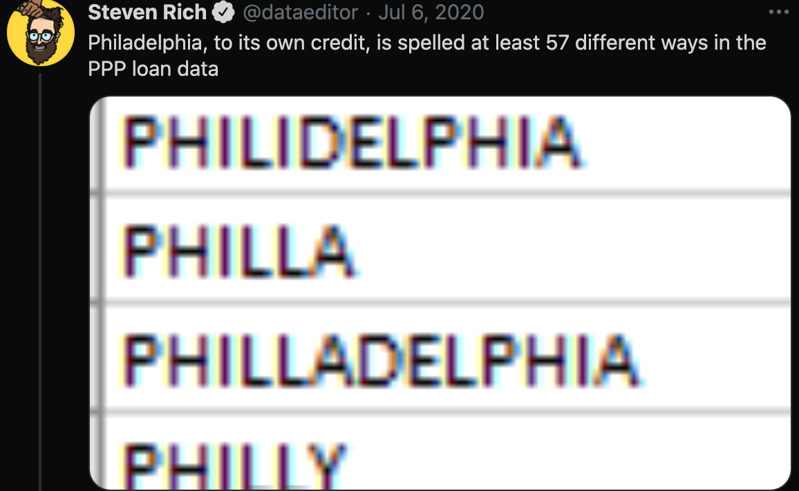
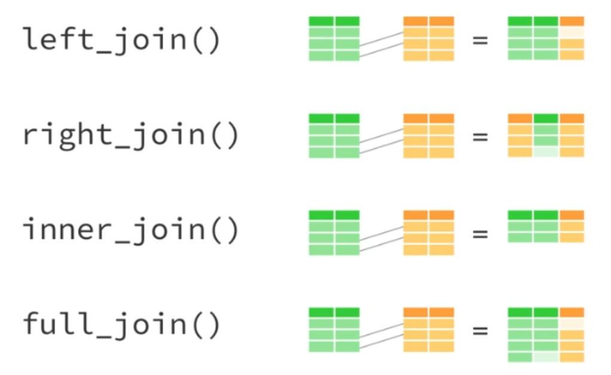

```{r setup, include=FALSE}
#knitr::opts_chunk$set(echo = FALSE)
library(tidyverse)
```

# Objectives

- Improve skills in data wrangling, familiarity with tools of `dplyr`
- Understand how to use conditional manipulators
  * `mutate_at`, `mutate_if`, `mutate_all`
- Learn how to merge and join datasets
  * `left_join`, `inner_join`
- Apply tools to in-the-wild datasets

---

# What is data wrangling?

- Wrangling data (also known as munging data) is the "process of gathering, selecting, and transforming data" to fit our analytical goals.

- Typically involves lots of *cleaning* of messy of values

- But also involves simple recoding of values for consistency

- There was apparently some survey showing that data scientists spend 80% of their time wrangling data.

---

# Classic problem



---

# Conditional recoding

- In the above Philadelphia example, we want all the values to be the same. They should all read "PHILADELPHIA". Getting there is painful, but important. 
- Generally we use `case_when` and, **if possible**, some combination of `str_detect`
 * `case_when` is just a more versatile version of `ifelse`

```{r, echo = T}
example_df <- data.frame(obs = c(1, 2, 3), 
                         city = c("PHILLY", "PHILA", "PHILADELPHIA"))
example_df <-
  example_df %>%
  mutate(city = case_when(city == "PHILLY" ~ "PHILADELPHIA",
                          city == "PHILA" ~ "PHILADELPHIA",
                          TRUE ~ city))

summary(factor(example_df$city))
```

---

# Multivariate conditional recoding

- Consider a case in which we have multiple variables that need to be recoded in a similar fashion. `dplyr` allows us to recode and manipulate multiple variables at one time, rather than writing each conditional statement over again for each variable.
 * Here, we use `mutate_at`
 * Another version is `mutate_if` which functions similarly.

```{r, echo = T, message = F, warning=F}
example_df <- data.frame(obs = c("A-1", "A-2", "A-3"), 
                         city_of_residence = c("PHILLY", "PHILA", "PHILADELPHIA"),
                         city_of_birth = c("PHILADELPHIA", "PHILLY", "PHILADELPH"))
example_df <-
  example_df %>%
  mutate_at(vars(city_of_residence, city_of_birth),
            funs(case_when(. %in% c("PHILLY", "PHILA", "PHILADELPH") ~ "PHILADELPHIA",
                               TRUE ~ .)))

example_df
```

---

# Merging and joining datasets - Part 1

- We often want to merge datasets together for the purposes of our analysis. For instance:
  * U.S. police stop data with municipal election results (Thompson, 2020, APSR)
  * Indian riots with state-level legislative election results (Nellis, Rosensweig, Weaver, 2018, QJPS)
- First order question before merging: what is your **unit of analysis**?
- Second order question: are your unique identifiers (1) formatted the same, (2) truly unique?

---
# Merging and joining datasets - Part 2

- `dplyr` offers several tools for merging data, which are implemented in different manners with different consequences.


---
# Merging and joining datasets - Part 3

 - Let's do an example of merging data sets using `left_join`
  * In general, I only use `left_join` for merging.
```{r, echo = T, message = F, warning=F}
example_df_income <- data.frame(id = c("A-1", "A-3"), 
                                #notice different var name
                                # notice number of observations
                                monthly_income = c(1200, 2400)) 

merged_df <-
  left_join(example_df,
            example_df_income,
            by = c("obs" = "id"))

merged_df
```

---

# In-the-wild example

- Download csvs in lecture_notes >> week4 >> data
- Today we are looking at the 2012 municipal elections in Brazil
- My theory: **support for leftist parties declines when weather conditions on eletion day are adverse.**
- My data: 
  * `br_muni_elections_2012.csv` contains municipal-level data vote share for leftist parties in all Brazilian municipalities.
  * `brazil_weather_oct_2012.csv` contains weather-station-level data on weather conditions for October 2012 in three Brazilian provinces.
