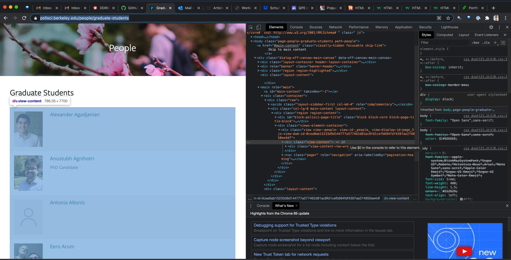
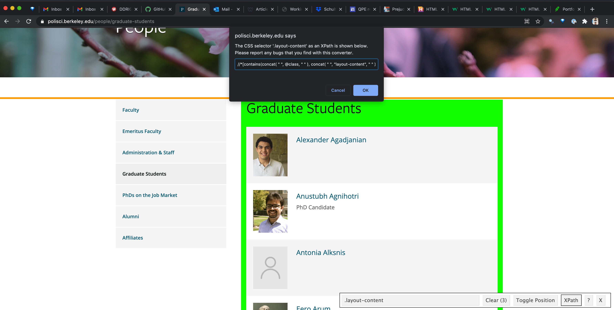
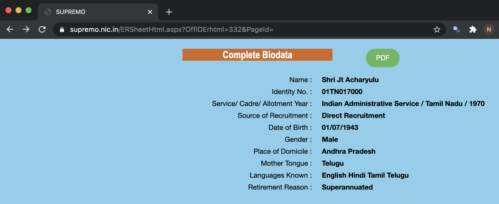

```{r setup, include=FALSE}
knitr::opts_chunk$set(echo = F)
library(tidyverse)
library(rvest)
library(magrittr)
library(RSelenium)
library(wdman)
```

## Goals

1. Learn how to use *SelectorGadget*  and *rvest* to scrape a **single** static page

2. Learn how to use *RSelenium* to scrape a **single** dynamic webpage

3. Learn how to write functions that can scrape **many** such pages
  

---


## Rules of thumb
1. Just ask for the data first

--

2. Look for a backdoor json or csv file

--

3. Failing these steps, and with enough time, you can pretty much scrape anything*

--

  *with a strong enough commitment to trial and error


---

##Orienting to webpage basics (part one)
* Myth: "You must understand HTML to scrape websites"
* A few basics help, though:
  - HTML websites are mostly composed of `tags` and `attributes`
  - We mostly care about identifying `tags` which signal the start of an HTML element or piece of content.
  - Attributes convey additional information about HTML elements
    - `<table>` is a *tag* that indicates the start of a table
    - `<tr>` is a *tag* that indicates the start of a row within a table
    - `<a>` is a *tag* that indicates a link
    - `href` is an *attribute* that provides the url to the link.

---
    
##Orienting to webpage basics (part two)
* HTML tags and attributes are basic building blocks of webpages
* But Cascading Style Sheets (CSS) is a way of organizing all the elements of a webpage in a unified manner
* Elements of a webpage thus have "CSS Selectors," we can often exploit for scraping
  
---

##Orienting to webscraping (part one)


* How do we get information we want from HTML webpage?
  - Old-school: open up google chrome developer tools and grab the css selector or xpath

  - Better: use selectorgadget to get the css selector
  
---
##Orienting to webscraping (old school)


---
##Orienting to scraping basics (selectorgadget)
  

---

##Now what?

* Once you've identified where the content you want is housed with the HTML architecture, what next?
* Enter `rvest`, a package designed to make simple the downloading of entire webpages' HTML
* We will generally download the whole page, then parse the page to identify the elements we want, and then restructure those elements.
---

##rvest workflow

.pull-left[

##steps

1. Read a single URL into rvest

2. Wrangle output to get what you want (using selector gadget or otherwise)

3. Look for patterns in URL structure to scale up steps 1-2 using a generalized function
  
  * Crawling as a less-desirable option

]

.pull-right[

## implementation

* read_html()

* html_text(); html_table(); html_attr(); html_node(); tidyverse

* brute force for-loops, apply
]

---

## What if webpage information is dynamic and URLs can't be patterned?
* Many webpages use Javascript and jQuery to get data based on form inputs.
* Two solutions: (1) SplashR and (2) RSelenium
* RSelenium operates as virtual browser, literally clicking buttons and pressing the keys you want it to. It mimics a human interacting with a webpage.
* We use RSelenium to get around things like dropdown menus and webpages that require form inputs (e.g., passwords, zip codes)

---

#Indian Civil Service Example



