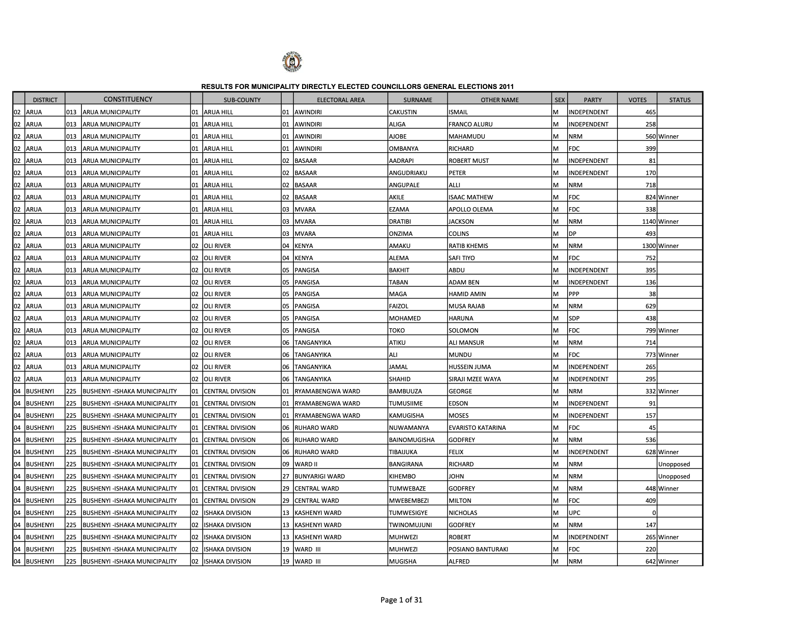
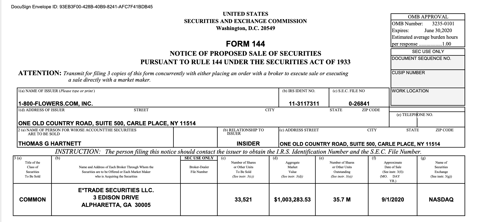
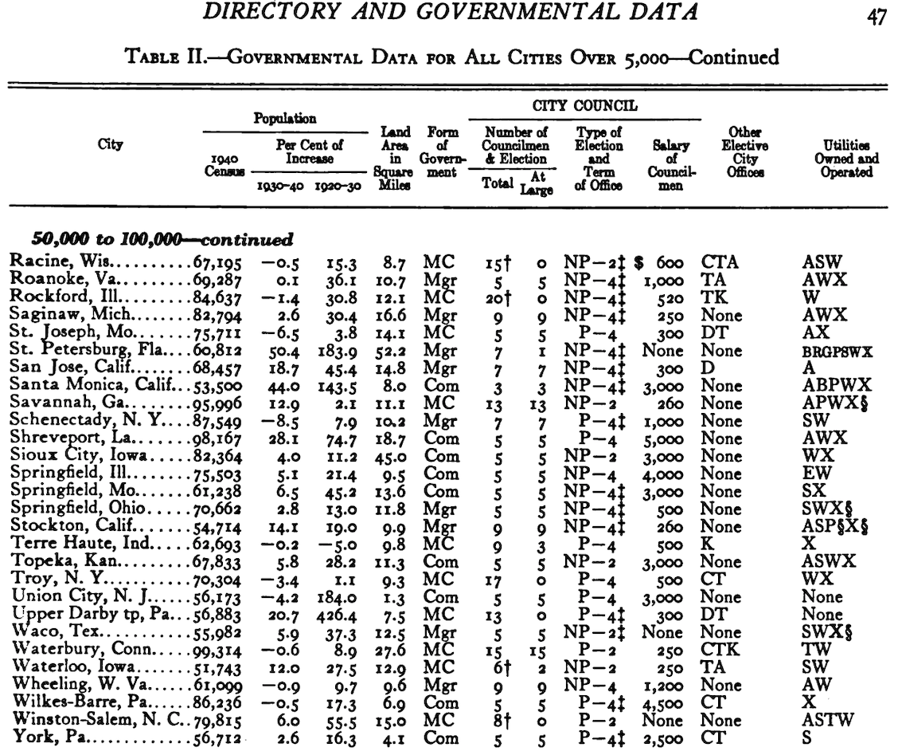

```{r setup, include=FALSE}
knitr::opts_chunk$set(echo = FALSE)
```

## Approaches to PDF Scraping

There is a hierarchy of difficulty to PDF scraping. In this tutorial, we will cover three tiers of difficulty:

- **Tier 1 (Normal):** Structured tabular PDFs 
  - e.g., electoral returns
- **Tier 2 (Nightmare):** Structured text-based PDFs
  - e.g., legislative 
  transcripts, IRS 990s
- **Tier 3 (Hell):** Unstructured image-based PDFs 
  - e.g., archival documents, pre-1940 US census records
  
----

## My advice

- **Just ask:** As with web scraping, there is usually an institutional source compiling these PDFs. Just ask for the underlying data.

- **Tolerate large errors:** Particularly at Tiers 2 and 3, the data will be messy beyond what can be cleaned.
  - Is there a case to be made that errors are distributed randomly?

- **Submit to the document:** Particularly at Tier 3 you need to exploit the structure of the document, identifying patterns *from the perspective of the original author.*

  
----

## R Packages for PDF scraping

 - Structured tabular PDFs: **tabulizer**
 
 - Structured text-based PDFs: **pdftools**
 
 - Unstructured image-based PDFs: **magick** \& **tesseract**
 

----

## General workflow for PDF scraping

 1. Successfully scrape one page
 
 2. Generalize solution in function
 
 3. Scrape many pages using **parallelization**
 
    - packages: parallel

----

## Sidebar: what is parallelization?

PDF scraping is often computationally more intensive than web-scraping, as it relies on the raw computing power of your local machine (rather than the bandwidth of your internet connection). This has many downsides, but also some nice solutions that aren't relevant for web-scraping.

- When you are running RStudio usually, everything is happening on one core.

- But your machine has more than one core!

- When we parallelize, we are distributing each iteration of the function onto as many available cores as possible, cutting the time down by the factor of your cores.

----

## Scraping structured tabular PDFs: Workflow

1. Use extract_tables() function from tabulizer

2. Clean output using tidyverse

3. Scale up function

----


## Scraping structured tabular PDFs: Uganda Example

{width=80%}


----

## Scraping structured text-based PDFs: Workflow

1. Use pdf_data() to read in pdf text

2. Identify relevant spatial parameters of text you desire

3. Extract text from spatial parameters; concatenate pieces together

4. Scale up function

----


## Scraping structured text-based PDFs: SEC Example

{width=80%}

----

## Scraping unsctructured tabular-based PDFs: Workflow

1. Use magick to pre-process pdf

2. Use tesseract (implemented thru magick, or otherwise) to convert PDF to text lines

3. Identify patterns in the underlying structure of the original document

4. Use stringi to split and extract text based on these patterns

5. Scale up function

----

## Scraping unstructured tabular PDFs: Municipal yearbook Example

{width=80%}

----


